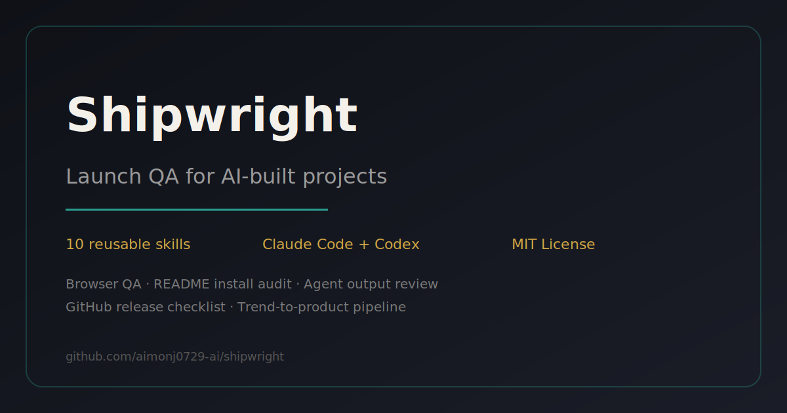

<p align="center">
  
</p>

<h1 align="center">Shipwright</h1>

<p align="center">
  <strong>Launch QA skills for AI-built projects.</strong>
</p>

<p align="center">
  Turn GitHub trends, rough ideas, vibe-coded apps, and agent output into repositories
  that strangers can install, trust, and actually use.
</p>

<p align="center">
  <a href="https://shipwright.com.cn">Live demo</a>
  ·
  <a href="#quick-start">Quick start</a>
  ·
  <a href="#skills">Skills</a>
  ·
  <a href="#examples">Examples</a>
  ·
  <a href="#doctor-mode">Doctor mode</a>
</p>

<p align="center">
  
  
  
  
</p>

---

## Why Shipwright

AI coding agents are great at producing work that *looks finished*. Shipwright is for the
last mile: the unglamorous checks that decide whether a project is ready for real users.

It helps answer:

- **Can a stranger install this from the README without asking me?**
- **Did the browser actually open, or did we only inspect the diff?**
- **Did the agent really finish the feature, or leave fake buttons and TODOs?**
- **Is this GitHub repo packaged clearly enough to earn trust?**
- **Can a trend become a smaller, sharper product people will use?**

Shipwright is not a prompt dump. It is a set of reusable Claude Code and Codex skills for
turning messy builder work into launch-ready evidence.

## What You Get

| Job | Use this | Output |
| --- | --- | --- |
| Find useful GitHub trends | `github-radar` | A ranked radar of tools to use, ideas to copy ethically, and hype to ignore. |
| Turn a hot repo into a product angle | `trend-to-product` | A differentiated product brief with audience, wedge, risks, and MVP. |
| Shape a rough idea | `idea-to-prd` | A lean PRD with assumptions, scope, acceptance criteria, and non-goals. |
| Plan implementation | `prd-to-issues` | GitHub-ready issues ordered by delivery sequence. |
| Audit before launch | `launch-readiness` | A launch-readiness report with blockers, trust gaps, and next patch. |
| Open the real app | `browser-launch-audit` | Browser QA for console errors, mobile layout, broken interactions, and trust gaps. |
| Test the README path | `readme-install-audit` | First-time-user install verdict and README patch notes. |
| Review AI-generated work | `agent-output-review` | Findings for hallucinated claims, fake-complete features, and missing verification. |
| Package for GitHub | `github-release-checklist` | Repo description, topics, release notes, launch copy, and final blockers. |
| Productize a workflow | `workflow-to-skill` | A clean installable `SKILL.md` from a repeated agent workflow. |

## Quick Start

Clone the repo:

```bash
git clone https://github.com/aimonj0729-ai/shipwright.git
cd shipwright
```

Install into Claude Code:

```bash
./scripts/install.sh --claude
```

Install into Codex:

```bash
./scripts/install.sh --codex
```

Install into a generic agent skills directory:

```bash
./scripts/install.sh
```

Restart your agent after installing so it reloads the skill metadata.

### Expected Result

After install, your agent should be able to invoke skills such as:

```text
Use browser-launch-audit on http://localhost:3000.
Check console errors, broken interactions, mobile layout, and launch trust gaps.
```

or:

```text
Use readme-install-audit on this repository.
Follow the README like a first-time user and tell me where adoption breaks.
```

## Product Demo

The website is live at **[shipwright.com.cn](https://shipwright.com.cn)**.

It includes:

- A launch QA landing page.
- A static analyzer demo that generates a Markdown report.
- An AI Planner panel with BYOK settings and a no-key demo mode.
- A catalog of the skills in this repository.

Preview locally:

```bash
python3 -m http.server 4173 --directory site
```

Then open:

```text
http://localhost:4173
```

### Honest Limitation

The hosted website is currently a product demo. The real executable workflows live in
`skills/` and run inside Claude Code, Codex, or another compatible agent environment.

The web analyzer does **not** yet clone repositories, run Playwright in the cloud, or execute
server-side Doctor checks. That is the next product layer.

## Common Workflows

### 1. From GitHub Trend To Product

```text
Scan today's GitHub Trending and tell me which projects are worth using,
which are worth copying ethically, and which I should ignore.
```

Then:

```text
Take the strongest opportunity from that radar report and turn it into
a smaller product brief for indie developers.
```

### 2. From Idea To Build Plan

```text
Turn this idea into a lean PRD:
a daily GitHub radar that finds workflow and skill ideas for AI builders.
```

Then:

```text
Break this PRD into GitHub issues for a first release.
Keep the first slice shippable in one weekend.
```

### 3. Launch QA For A Vibe-Coded App

```text
Audit this repository for launch readiness before I post it on GitHub, X, and Product Hunt.
Check README install friction, browser proof, fake-complete AI output, and GitHub metadata.
```

### 4. Browser Proof Before Shipping

```text
Open http://localhost:3000 and audit whether this app is ready to launch.
Check console errors, broken interactions, mobile layout, empty states, and trust gaps.
```

### 5. Turn A Repeated Workflow Into A Skill

```text
Turn my launch QA workflow into a reusable Codex/Claude skill.
Keep the trigger description specific and include an example output format.
```

## Skills

| Skill | Category | Best used for |
| --- | --- | --- |
| [`github-radar`](skills/github-radar/SKILL.md) | Research | Filtering GitHub Trending and hot repos into useful builder signals. |
| [`trend-to-product`](skills/trend-to-product/SKILL.md) | Product | Turning a repo, trend, or competitor into a differentiated product wedge. |
| [`idea-to-prd`](skills/idea-to-prd/SKILL.md) | Product | Converting a rough idea into a scoped PRD. |
| [`prd-to-issues`](skills/prd-to-issues/SKILL.md) | Planning | Turning a PRD into GitHub-ready implementation issues. |
| [`launch-readiness`](skills/launch-readiness/SKILL.md) | Launch | Auditing README, install, trust, demo, and conversion gaps. |
| [`browser-launch-audit`](skills/browser-launch-audit/SKILL.md) | QA | Verifying the actual browser experience before launch. |
| [`readme-install-audit`](skills/readme-install-audit/SKILL.md) | QA | Testing whether a stranger can install and use the repo from README alone. |
| [`agent-output-review`](skills/agent-output-review/SKILL.md) | QA | Catching hallucinated claims and fake-complete AI work. |
| [`github-release-checklist`](skills/github-release-checklist/SKILL.md) | Launch | Preparing metadata, release notes, launch copy, and final blockers. |
| [`workflow-to-skill`](skills/workflow-to-skill/SKILL.md) | Skill building | Packaging a repeated agent workflow into an installable skill. |

## Example Report

Shipwright reports are designed to be copied directly into Claude Code or Codex as the next
fix plan.

```markdown
## Launch Verdict

Almost ready — but do not publish yet.

## P1 Findings

- README omits required environment variables.
- Mobile nav clips below 390px.
- Primary CTA works, but no error state is visible.

## Quick Wins

- Add expected terminal output after the install command.
- Add one verified browser screenshot.
- Add GitHub topics and a clearer repository description.

## Next Patch

Run the browser audit, fix the mobile nav, and update the README quickstart before launch.
```

## Examples

The `examples/` directory contains sample outputs from real skill runs:

- [GitHub Radar Report](examples/github-radar-report.md)
- [Product Brief](examples/product-brief.md)
- [Idea to PRD](examples/idea-to-prd.md)
- [PRD to Issues](examples/prd-to-issues.md)
- [Launch Readiness Audit](examples/launch-readiness.md)
- [Browser Launch Audit](examples/browser-launch-audit.md)
- [README Install Audit](examples/readme-install-audit.md)
- [Agent Output Review](examples/agent-output-review.md)
- [Launch QA Report](examples/launch-qa-report.md)
- [Workflow to Skill](examples/workflow-to-skill.md)

## Doctor Mode

Shipwright Doctor is the next product direction.

The goal: paste a GitHub repo, live demo URL, README, or rough website idea and receive a
real launch diagnosis with evidence.

Planned checks:

- GitHub metadata, README, package files, topics, and repo freshness.
- Browser checks for title, meta tags, console errors, failed network requests, CTA behavior,
  and 390px / 768px mobile layout.
- README install friction and missing expected output.
- AI-generated output review for fake buttons, placeholders, and unverified claims.
- Markdown export with P0/P1/P2/P3 findings and a Codex/Claude-ready fix prompt.

Safety rule: Shipwright Doctor should read and inspect untrusted projects, but should not
execute arbitrary repository code.

## Repository Structure

```text
shipwright/
├── skills/        # Installable Claude Code / Codex skills
├── examples/      # Sample reports and workflow outputs
├── scripts/       # Install and validation scripts
├── site/          # Product demo website
├── catalog.json   # Machine-readable skill catalog
└── README.md
```

## Validate

Run the catalog check:

```bash
./scripts/validate-catalog.sh
```

Preview the website:

```bash
python3 -m http.server 4173 --directory site
```

## Contributing

Shipwright works best when every skill has:

- A specific trigger description.
- A concrete input and output format.
- A real example report.
- Honest limitations.
- A first-use path that does not require guessing.

See [CONTRIBUTING.md](CONTRIBUTING.md) for contribution guidelines.

## License

MIT
